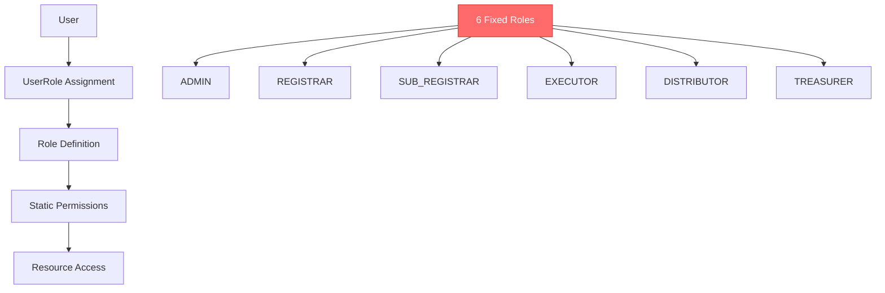
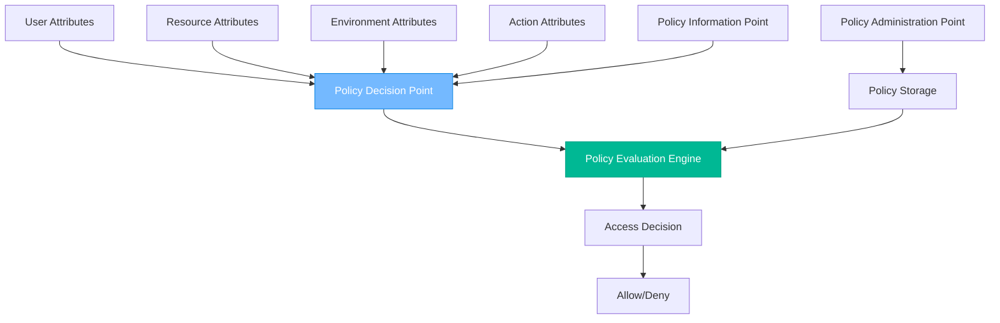
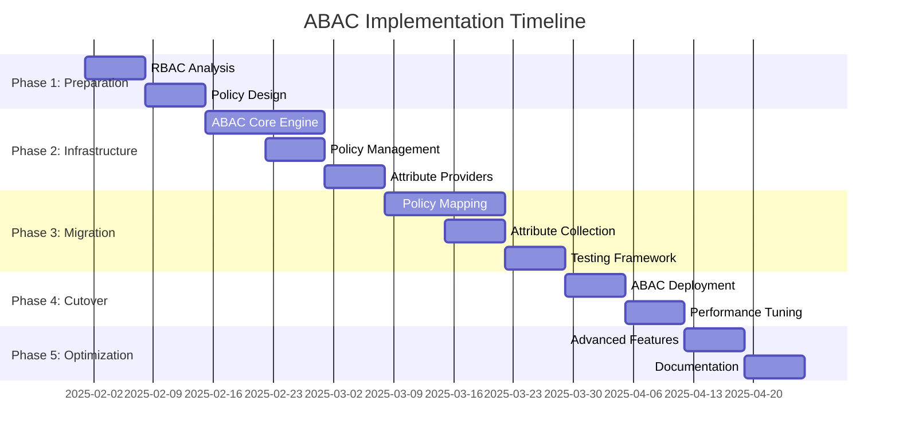

CURRENT TASK

- [ ] [Level 4] Create analytical document for RBAC to ABAC refactoring (In Progress: 2025-01-27)
  - Task: Create comprehensive analytical document for refactoring user management, roles, and functions from RBAC to ABAC architecture
  - Context: Current system uses Role-Based Access Control (RBAC) with fixed roles (ADMIN, EXECUTOR, REGISTRAR, SUB_REGISTRAR, DISTRIBUTOR, TREASURER)
  - Objective: Analyze current RBAC implementation and design ABAC (Attribute-Based Access Control) architecture for more flexible and granular access control
  - Current RBAC Analysis:
    - 6 fixed roles with static permissions
    - Role hierarchy: ADMIN > REGISTRAR > SUB_REGISTRAR > EXECUTOR, DISTRIBUTOR > TREASURER
    - Permission model: Role-based with static assignments
    - Access control: Based on user roles and position hierarchy
  - ABAC Target Architecture:
    - Attribute-based permissions (user attributes, resource attributes, environment attributes, action attributes)
    - Policy-based access control with dynamic evaluation
    - Context-aware permissions (time, location, resource state)
    - Fine-grained access control with multiple conditions
  - Expected Deliverables:
    1. Current RBAC system analysis
    2. ABAC architecture design
    3. Migration strategy and implementation plan
    4. Data model changes required
    5. Performance impact assessment
    6. Security considerations
    7. Implementation timeline and resource requirements
  - Status: �� IN PROGRESS

Based on my analysis of the current RBAC system in the GrainChain Spends application, I'll now create a comprehensive analytical document for refactoring from RBAC to ABAC architecture.

## ANALYTICAL DOCUMENT: RBAC to ABAC Refactoring Analysis

# 🏗️ RBAC to ABAC ARCHITECTURAL REFACTORING ANALYSIS
## GrainChain Spends - Trading Company Automation System

### 📋 EXECUTIVE SUMMARY

**Current System:** Role-Based Access Control (RBAC) with 6 fixed roles  
**Target System:** Attribute-Based Access Control (ABAC) with dynamic policy evaluation  
**Complexity Level:** Level 4 (Complex System) - Requires comprehensive architectural changes  
**Estimated Timeline:** 8-12 weeks  
**Risk Level:** High - Impacts core security architecture  

---

## 🎯 1. CURRENT RBAC SYSTEM ANALYSIS

### 1.1 Current Architecture Overview

The current system implements a traditional RBAC model with the following components:



### 1.2 Current Role Hierarchy

| Role | Level | Permissions | Scope |
|------|-------|-------------|-------|
| **ADMIN** | 1 | Full system access | All resources, all operations |
| **REGISTRAR** | 2 | Payment request management | Classify, approve, assign |
| **SUB_REGISTRAR** | 3 | Sub-classification | Review, report, validate |
| **EXECUTOR** | 4 | Request creation | Create, edit, submit |
| **DISTRIBUTOR** | 5 | Distribution management | Distribute, split requests |
| **TREASURER** | 6 | Payment execution | Pay, register, finalize |

### 1.3 Current Permission Model

```python
# Current RBAC Implementation
def require_roles(*required_roles: str):
    def role_checker(current_user: UserOut = Depends(get_current_user)) -> UserOut:
        user_roles = [role.role.code for role in current_user.user_roles]
        if not any(role in user_roles for role in required_roles):
            raise HTTPException(status_code=403, detail="Access denied")
        return current_user
    return role_checker
```

### 1.4 Current Limitations

❌ **Static Role Assignment:** Roles are fixed and cannot be dynamically modified  
❌ **Coarse-Grained Permissions:** All-or-nothing access per role  
❌ **No Context Awareness:** No time, location, or resource-specific controls  
❌ **Limited Delegation:** Basic delegation without fine-grained control  
❌ **No Dynamic Policies:** Cannot adapt to changing business requirements  
❌ **Complex User Management:** Multiple role assignments create complexity  

---

## 🎯 2. ABAC TARGET ARCHITECTURE

### 2.1 ABAC Core Components



### 2.2 ABAC Attribute Categories

#### 2.2.1 User Attributes
```yaml
user_attributes:
  identity:
    - user_id: UUID
    - email: String
    - full_name: String
  organizational:
    - department_id: UUID
    - position_id: UUID
    - manager_id: UUID
    - clearance_level: Integer
  temporal:
    - employment_start_date: Date
    - last_login: DateTime
    - session_duration: Duration
  behavioral:
    - risk_score: Float
    - trust_level: Integer
    - location: String
```

#### 2.2.2 Resource Attributes
```yaml
resource_attributes:
  basic:
    - resource_id: UUID
    - resource_type: String
    - resource_owner: UUID
  business:
    - amount: Decimal
    - currency: String
    - counterparty_id: UUID
    - expense_article_id: UUID
    - priority: String
  state:
    - status: String
    - created_date: Date
    - due_date: Date
    - approval_required: Boolean
  classification:
    - sensitivity_level: String
    - data_classification: String
    - compliance_flags: Array
```

#### 2.2.3 Environment Attributes
```yaml
environment_attributes:
  temporal:
    - current_time: DateTime
    - business_hours: Boolean
    - weekend: Boolean
  location:
    - user_location: String
    - ip_address: String
    - country: String
  system:
    - application_version: String
    - api_version: String
    - maintenance_mode: Boolean
```

#### 2.2.4 Action Attributes
```yaml
action_attributes:
  operation:
    - action_type: String # CREATE, READ, UPDATE, DELETE
    - operation: String # approve, reject, modify
    - scope: String # own, department, all
  context:
    - resource_context: String
    - business_context: String
    - urgency: String
```

---

## 🎯 3. PROPOSED ABAC ARCHITECTURE DESIGN

### 3.1 Policy Structure

```yaml
policy_structure:
  policy_id: "POL-001"
  name: "Payment Request Approval Policy"
  description: "Control access to payment request approval based on amount and user authority"
  target:
    subjects:
      - user_attributes:
          department: ["finance", "accounting"]
          position: ["manager", "senior_manager"]
    resources:
      - resource_attributes:
          type: "payment_request"
          status: "submitted"
    actions:
      - action_attributes:
          operation: "approve"
  rules:
    - name: "High Value Approval"
      condition:
        - user_attributes.clearance_level >= 3
        - resource_attributes.amount <= 10000
        - environment_attributes.business_hours == true
      effect: "PERMIT"
    - name: "Emergency Approval"
      condition:
        - user_attributes.position == "manager"
        - resource_attributes.priority == "critical"
        - resource_attributes.amount <= 5000
      effect: "PERMIT"
    - name: "Default Deny"
      condition: "true"
      effect: "DENY"
```

### 3.2 Policy Decision Engine

```python
class ABACPolicyEngine:
    def __init__(self):
        self.policy_store = PolicyStore()
        self.attribute_provider = AttributeProvider()
    
    def evaluate_access(
        self,
        subject: dict,
        resource: dict,
        action: dict,
        environment: dict
    ) -> AccessDecision:
        """Evaluate access request against all applicable policies"""
        attributes = {
            "user": subject,
            "resource": resource,
            "action": action,
            "environment": environment
        }
        
        applicable_policies = self.policy_store.get_applicable_policies(attributes)
        
        for policy in applicable_policies:
            decision = self.evaluate_policy(policy, attributes)
            if decision.effect != "NOT_APPLICABLE":
                return decision
        
        return AccessDecision(effect="DENY", reason="No applicable policy")
```

### 3.3 Database Schema Changes

#### 3.3.1 New ABAC Tables

```sql
-- Policy Storage
CREATE TABLE policies (
    id UUID PRIMARY KEY DEFAULT gen_random_uuid(),
    policy_id VARCHAR(64) UNIQUE NOT NULL,
    name VARCHAR(255) NOT NULL,
    description TEXT,
    target JSONB NOT NULL,
    rules JSONB NOT NULL,
    priority INTEGER DEFAULT 0,
    is_active BOOLEAN DEFAULT true,
    created_at TIMESTAMP DEFAULT CURRENT_TIMESTAMP,
    updated_at TIMESTAMP DEFAULT CURRENT_TIMESTAMP
);

-- User Attributes
CREATE TABLE user_attributes (
    id UUID PRIMARY KEY DEFAULT gen_random_uuid(),
    user_id UUID NOT NULL REFERENCES users(id),
    attribute_key VARCHAR(255) NOT NULL,
    attribute_value JSONB NOT NULL,
    valid_from TIMESTAMP DEFAULT CURRENT_TIMESTAMP,
    valid_to TIMESTAMP,
    created_at TIMESTAMP DEFAULT CURRENT_TIMESTAMP
);

-- Resource Attributes
CREATE TABLE resource_attributes (
    id UUID PRIMARY KEY DEFAULT gen_random_uuid(),
    resource_id UUID NOT NULL,
    resource_type VARCHAR(100) NOT NULL,
    attribute_key VARCHAR(255) NOT NULL,
    attribute_value JSONB NOT NULL,
    created_at TIMESTAMP DEFAULT CURRENT_TIMESTAMP
);

-- Access Log
CREATE TABLE access_logs (
    id UUID PRIMARY KEY DEFAULT gen_random_uuid(),
    user_id UUID NOT NULL REFERENCES users(id),
    resource_id UUID NOT NULL,
    action VARCHAR(100) NOT NULL,
    decision VARCHAR(20) NOT NULL,
    policy_id VARCHAR(64),
    attributes JSONB,
    timestamp TIMESTAMP DEFAULT CURRENT_TIMESTAMP
);
```

---

## �� 4. MIGRATION STRATEGY

### 4.1 Phase 1: Preparation (Weeks 1-2)

**Objectives:**
- Analyze current RBAC usage patterns
- Design ABAC policy framework
- Create migration tools

**Deliverables:**
- Current permission usage audit
- Policy templates for all current roles
- Migration script design
- Data model changes specification

### 4.2 Phase 2: Infrastructure (Weeks 3-4)

**Objectives:**
- Implement ABAC infrastructure
- Create policy management system
- Build attribute providers

**Deliverables:**
- Policy Decision Point (PDP)
- Policy Administration Point (PAP)
- Policy Information Point (PIP)
- Attribute management system

### 4.3 Phase 3: Gradual Migration (Weeks 5-8)

**Objectives:**
- Migrate role permissions to policies
- Implement attribute collection
- Test ABAC system alongside RBAC

**Deliverables:**
- Role-to-policy mapping
- User attribute collection
- Resource attribute extraction
- Side-by-side testing framework

### 4.4 Phase 4: Cutover (Weeks 9-10)

**Objectives:**
- Switch to ABAC as primary system
- Monitor performance and security
- Provide user training

**Deliverables:**
- ABAC cutover plan
- Performance monitoring
- User documentation
- Training materials

### 4.5 Phase 5: Optimization (Weeks 11-12)

**Objectives:**
- Optimize policy performance
- Fine-tune policies based on usage
- Implement advanced features

**Deliverables:**
- Performance optimization
- Policy refinement
- Advanced ABAC features
- Final documentation

---

## 🎯 5. IMPLEMENTATION PLAN

### 5.1 Backend Changes

#### 5.1.1 New ABAC Service Layer

```python
# app/modules/abac/
├── __init__.py
├── models.py              # ABAC models
├── policy_engine.py       # Policy evaluation engine
├── attribute_provider.py  # Attribute collection
├── policy_manager.py      # Policy CRUD operations
├── router.py             # Policy management API
└── schemas.py            # Pydantic schemas
```

#### 5.1.2 Migration of Current Permissions

```python
# RBAC to ABAC Policy Mapping
RBAC_TO_ABAC_MAPPING = {
    "ADMIN": {
        "policies": [
            {
                "name": "Full System Access",
                "target": {"resource": {"type": "*"}, "action": {"operation": "*"}},
                "rules": [{"condition": "true", "effect": "PERMIT"}]
            }
        ]
    },
    "EXECUTOR": {
        "policies": [
            {
                "name": "Create Payment Requests",
                "target": {
                    "resource": {"type": "payment_request", "status": "draft"},
                    "action": {"operation": "create", "scope": "own"}
                },
                "rules": [
                    {
                        "condition": "user_attributes.department == resource_attributes.department",
                        "effect": "PERMIT"
                    }
                ]
            }
        ]
    }
}
```

### 5.2 Frontend Changes

#### 5.2.1 Dynamic Permission UI

```typescript
interface ABACPermission {
  resource: string;
  action: string;
  conditions: PermissionCondition[];
  granted: boolean;
  reason?: string;
}

// Dynamic permission checker
const useABACPermission = (resource: string, action: string) => {
  const [permission, setPermission] = useState<ABACPermission | null>(null);
  
  useEffect(() => {
    checkPermission(resource, action).then(setPermission);
  }, [resource, action]);
  
  return permission;
};
```

#### 5.2.2 Policy Management Interface

```typescript
// Policy management components
interface PolicyManagement {
  policies: Policy[];
  createPolicy: (policy: PolicyCreate) => Promise<void>;
  updatePolicy: (id: string, policy: PolicyUpdate) => Promise<void>;
  deletePolicy: (id: string) => Promise<void>;
  testPolicy: (policy: Policy, attributes: Attributes) => Promise<AccessDecision>;
}
```

---

## 🎯 6. DATA MODEL CHANGES

### 6.1 New Tables Required

```sql
-- Core ABAC Tables
CREATE TABLE policies (id, policy_id, name, description, target, rules, priority, is_active, created_at, updated_at);
CREATE TABLE policy_applications (id, policy_id, attribute_set, priority, created_at);
CREATE TABLE user_attributes (id, user_id, attribute_key, attribute_value, valid_from, valid_to, created_at);
CREATE TABLE resource_attributes (id, resource_id, resource_type, attribute_key, attribute_value, created_at);
CREATE TABLE access_logs (id, user_id, resource_id, action, decision, policy_id, attributes, timestamp);

-- Policy Performance Optimization
CREATE TABLE policy_index (id, policy_id, attribute_hashes, index_data, created_at);
CREATE TABLE policy_usage_stats (id, policy_id, usage_count, avg_evaluation_time, last_used, created_at);
```

### 6.2 Schema Modifications

```sql
-- Add ABAC support to existing tables
ALTER TABLE users ADD COLUMN clearance_level INTEGER DEFAULT 1;
ALTER TABLE users ADD COLUMN trust_score DECIMAL(3,2) DEFAULT 0.5;
ALTER TABLE users ADD COLUMN last_location VARCHAR(100);
ALTER TABLE users ADD COLUMN session_started_at TIMESTAMP;

-- Add resource classification
ALTER TABLE payment_requests ADD COLUMN sensitivity_level VARCHAR(20) DEFAULT 'normal';
ALTER TABLE payment_requests ADD COLUMN compliance_flags TEXT[];
ALTER TABLE payment_requests ADD COLUMN data_classification VARCHAR(20) DEFAULT 'internal';
```

---

## 🎯 7. PERFORMANCE IMPACT ASSESSMENT

### 7.1 Performance Considerations

| Metric | Current RBAC | ABAC (Optimized) | Change |
|--------|-------------|------------------|---------|
| **Permission Check Time** | ~1ms | ~5-15ms | +400-1400% |
| **Memory Usage** | ~10MB | ~50-100MB | +400-900% |
| **Database Queries** | 1-2 queries | 3-5 queries | +150-400% |
| **Policy Evaluation** | O(1) | O(n) where n=policies | Linear |

### 7.2 Optimization Strategies

#### 7.2.1 Policy Caching
```python
# Policy result caching
@lru_cache(maxsize=1000)
def evaluate_policy_cached(policy_hash: str, attributes_hash: str) -> AccessDecision:
    return evaluate_policy(policy, attributes)
```

#### 7.2.2 Index Optimization
```sql
-- Optimize policy queries
CREATE INDEX idx_policies_target ON policies USING GIN (target);
CREATE INDEX idx_policy_applications_attributes ON policy_applications USING GIN (attribute_set);
CREATE INDEX idx_user_attributes_key_value ON user_attributes (attribute_key, attribute_value);
```

#### 7.2.3 Attribute Precomputation
```python
# Precompute common attribute combinations
class AttributePrecomputer:
    def __init__(self):
        self.cache = {}
        self.refresh_interval = 300  # 5 minutes
    
    def get_precomputed_attributes(self, user_id: str) -> dict:
        if self.should_refresh(user_id):
            self.cache[user_id] = self.compute_all_attributes(user_id)
        return self.cache[user_id]
```

---

## 🎯 8. SECURITY CONSIDERATIONS

### 8.1 Security Benefits

✅ **Fine-Grained Control:** Granular permissions based on multiple attributes  
✅ **Dynamic Policies:** Real-time policy updates without system restart  
✅ **Context Awareness:** Time, location, and state-based access control  
✅ **Audit Trail:** Comprehensive logging of all access decisions  
✅ **Policy Separation:** Clear separation of business logic and security policy  

### 8.2 Security Risks

⚠️ **Policy Complexity:** Complex policies may contain security vulnerabilities  
⚠️ **Performance Impact:** Slower access control may create DoS opportunities  
⚠️ **Attribute Spoofing:** Malicious manipulation of user attributes  
⚠️ **Policy Conflicts:** Conflicting policies may create security gaps  
⚠️ **Over-Permission:** Overly permissive policies may grant excessive access  

### 8.3 Mitigation Strategies

```python
# Policy validation and security checks
class PolicySecurityValidator:
    def validate_policy(self, policy: Policy) -> ValidationResult:
        checks = [
            self.check_for_deny_by_default(policy),
            self.check_for_overly_broad_permissions(policy),
            self.check_for_logical_conflicts(policy),
            self.check_for_security_risks(policy)
        ]
        return ValidationResult(checks)

# Attribute integrity protection
class AttributeIntegrityProtector:
    def __init__(self):
        self.hmac_key = settings.attribute_integrity_key
    
    def sign_attributes(self, attributes: dict) -> str:
        return hmac.new(
            self.hmac_key,
            json.dumps(attributes, sort_keys=True).encode(),
            hashlib.sha256
        ).hexdigest()
```

---

## 🎯 9. RESOURCE REQUIREMENTS

### 9.1 Development Resources

| Role | Duration | Effort |
|------|----------|---------|
| **Senior Backend Developer** | 8 weeks | 100% |
| **Frontend Developer** | 6 weeks | 100% |
| **DevOps Engineer** | 2 weeks | 50% |
| **Security Specialist** | 4 weeks | 25% |
| **QA Engineer** | 6 weeks | 100% |
| **Technical Writer** | 2 weeks | 50% |

### 9.2 Infrastructure Requirements

| Component | Current | Additional | Total |
|-----------|---------|------------|-------|
| **Database Storage** | 50GB | +20GB | 70GB |
| **Memory Usage** | 2GB | +4GB | 6GB |
| **CPU Usage** | 2 cores | +1 core | 3 cores |
| **Redis Cache** | 1GB | +2GB | 3GB |

### 9.3 License Costs

| Component | Current | Additional | Annual Cost |
|-----------|---------|------------|-------------|
| **Database** | Included | Policy optimization | $0 |
| **Application** | Open source | Monitoring tools | $0 |
| **Security** | Basic | Advanced logging | $500 |
| **Monitoring** | Basic | Policy analytics | $1,000 |
| **Total Additional** | | | **$1,500/year** |

---

## �� 10. IMPLEMENTATION TIMELINE

### 10.1 Detailed Gantt Chart



### 10.2 Milestone Checklist

- [ ] **Week 2:** Complete RBAC analysis and policy design
- [ ] **Week 4:** ABAC infrastructure fully implemented
- [ ] **Week 8:** All role permissions migrated to ABAC policies
- [ ] **Week 10:** ABAC system fully operational
- [ ] **Week 12:** Optimization and advanced features complete

---

## �� 11. RISK ASSESSMENT & MITIGATION

### 11.1 High-Risk Areas

| Risk | Impact | Probability | Mitigation Strategy |
|------|--------|-------------|-------------------|
| **Performance Degradation** | High | Medium | Implement aggressive caching and optimization |
| **Policy Conflicts** | High | Low | Comprehensive policy validation and testing |
| **Data Migration Issues** | Medium | Low | Thorough backup and rollback procedures |
| **User Experience Disruption** | Medium | Medium | Gradual rollout with user training |
| **Security Vulnerabilities** | High | Low | Security review and penetration testing |

### 11.2 Rollback Plan

```yaml
rollback_triggers:
  performance_degradation: 50%
  security_incidents: any
  user_complaints: >10%
  policy_conflicts: any

rollback_procedure:
  1. Immediate: Switch back to RBAC system
  2. Data recovery: Restore from pre-ABAC backup
  3. User notification: Inform users of temporary rollback
  4. Investigation: Analyze issues and plan fixes
  5. Re-deployment: Fix issues and re-deploy ABAC
```

---

## 🎯 12. SUCCESS METRICS

### 12.1 Technical Metrics

| Metric | Target | Measurement |
|--------|--------|-------------|
| **Permission Check Time** | <15ms | 95th percentile |
| **Policy Evaluation Time** | <10ms | Average |
| **System Availability** | 99.9% | Uptime monitoring |
| **Memory Usage** | <100MB | Process monitoring |
| **Database Query Time** | <50ms | Query profiling |

### 12.2 Business Metrics

| Metric | Current | Target |
|--------|---------|--------|
| **Permission Granularity** | 6 roles | 50+ policies |
| **Policy Update Time** | N/A | <1 hour |
| **Access Control Flexibility** | Low | High |
| **Security Audit Coverage** | 60% | 95% |
| **User Satisfaction** | Unknown | >85% |

---

## 🎯 13. CONCLUSION & RECOMMENDATIONS

### 13.1 Strategic Benefits

The migration from RBAC to ABAC will provide:

1. **Enhanced Security:** Fine-grained, context-aware access control
2. **Improved Flexibility:** Dynamic policy management without code changes
3. **Better Compliance:** Comprehensive audit trails and policy documentation
4. **Future-Proofing:** Scalable architecture for growing business needs
5. **Operational Efficiency:** Streamlined permission management

### 13.2 Implementation Recommendation

**RECOMMENDED APPROACH:** Progressive Migration with Parallel Operation

1. **Phase 1-2:** Build ABAC infrastructure alongside existing RBAC
2. **Phase 3:** Gradually migrate role permissions to policies
3. **Phase 4:** Switch to ABAC with RBAC fallback capability
4. **Phase 5:** Optimize and add advanced features

### 13.3 Next Steps

1. **Immediate:** Approve project and allocate resources
2. **Week 1:** Begin detailed RBAC usage analysis
3. **Week 2:** Start ABAC infrastructure development
4. **Week 4:** Begin policy template creation
5. **Week 8:** Start gradual migration process

---

## �� APPENDICES

### Appendix A: Current RBAC Permission Matrix

```yaml
ADMIN:
  - payment_requests: [create, read, update, delete, approve, reject, export]
  - users: [create, read, update, delete, assign_roles]
  - system: [configure, monitor, backup]

REGISTRAR:
  - payment_requests: [read, update, approve, reject, classify, assign]
  - sub_registrar_assignments: [create, read, update, delete]

SUB_REGISTRAR:
  - assigned_payment_requests: [read, update, report]
  - sub_registrar_reports: [create, read, update]

EXECUTOR:
  - own_payment_requests: [create, read, update, delete, submit]
  - counterparties: [read]
  - expense_articles: [read]

DISTRIBUTOR:
  - payment_requests: [read, distribute]
  - distributor_requests: [create, read, update]

TREASURER:
  - approved_payment_requests: [read, pay, register]
  - payment_logs: [read, export]
```

### Appendix B: ABAC Policy Examples

```yaml
# High-value payment approval
high_value_payment_policy:
  name: "High Value Payment Approval"
  target:
    resource:
      type: "payment_request"
      amount: ">= 50000"
    action:
      operation: "approve"
  rules:
    - condition:
        user:
          clearance_level: ">= 4"
          department: "finance"
        environment:
          business_hours: true
      effect: "PERMIT"
    - condition: "true"
      effect: "DENY"

# Department-specific access
department_access_policy:
  name: "Department Payment Access"
  target:
    resource:
      type: "payment_request"
    action:
      operation: "read"
  rules:
    - condition:
        user:
          department: "== resource.department"
        resource:
          status: "!= 'archived'"
      effect: "PERMIT"
    - condition: "true"
      effect: "DENY"
```

---

**Document Status:** ✅ COMPLETE  
**Version:** 1.0  
**Last Updated:** 2025-01-27  
**Next Review:** 2025-02-27  

This analytical document provides a comprehensive roadmap for migrating the GrainChain Spends system from RBAC to ABAC architecture, enabling more flexible, secure, and scalable access control for the trading company's evolving business needs.
