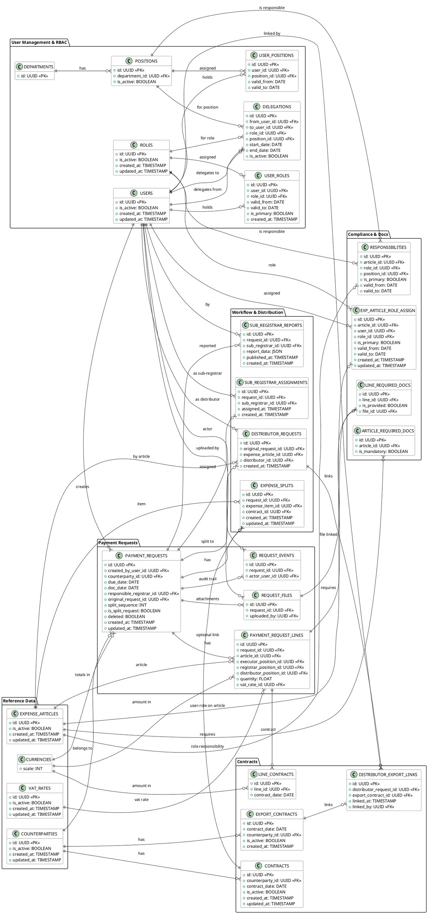

```plantuml
@startuml
!define ENTITY class
!define PK <<PK>>
!define FK <<FK>>
!define UK <<UK>>

hide methods
left to right direction
skinparam classBackgroundColor White
skinparam classBorderColor #333

package "User Management & RBAC" {
  class USERS {
    +id: UUID PK
    +full_name: VARCHAR(255)
    +email: VARCHAR(255) UK
    +phone: VARCHAR(50)
    +password_hash: VARCHAR(255)
    +is_active: BOOLEAN
    +created_at: TIMESTAMP
    +updated_at: TIMESTAMP
  }

  class ROLES {
    +id: UUID PK
    +code: VARCHAR(64) UK
    +name: VARCHAR(128)
    +is_active: BOOLEAN
    +created_at: TIMESTAMP
    +updated_at: TIMESTAMP
  }

  class DEPARTMENTS {
    +id: UUID PK
    +name: VARCHAR(255)
    +code: VARCHAR(64)
  }

  class POSITIONS {
    +id: UUID PK
    +department_id: UUID FK
    +title: VARCHAR(255)
    +description: VARCHAR(1000)
    +is_active: BOOLEAN
  }

  class USER_ROLES {
    +id: UUID PK
    +user_id: UUID FK
    +role_id: UUID FK
    +valid_from: DATE
    +valid_to: DATE
    +is_primary: BOOLEAN
    +created_at: TIMESTAMP
  }

  class USER_POSITIONS {
    +id: UUID PK
    +user_id: UUID FK
    +position_id: UUID FK
    +valid_from: DATE
    +valid_to: DATE
  }

  class DELEGATIONS {
    +id: UUID PK
    +from_user_id: UUID FK
    +to_user_id: UUID FK
    +role_id: UUID FK
    +position_id: UUID FK
    +start_date: DATE
    +end_date: DATE
    +reason: VARCHAR(1000)
    +is_active: BOOLEAN
  }
}

package "Reference Data" {
  class COUNTERPARTIES {
    +id: UUID PK
    +name: VARCHAR(255)
    +tax_id: VARCHAR(64)
    +category: VARCHAR(128)
    +is_active: BOOLEAN
    +created_at: TIMESTAMP
    +updated_at: TIMESTAMP
  }

  class CURRENCIES {
    +code: VARCHAR(3) PK
    +scale: INT
  }

  class VAT_RATES {
    +id: UUID PK
    +rate: NUMERIC(6,3)
    +name: VARCHAR(64)
    +is_active: BOOLEAN
    +created_at: TIMESTAMP
    +updated_at: TIMESTAMP
  }

  class EXPENSE_ARTICLES {
    +id: UUID PK
    +code: VARCHAR(64) UK
    +name: VARCHAR(255)
    +description: VARCHAR(1000)
    +is_active: BOOLEAN
    +created_at: TIMESTAMP
    +updated_at: TIMESTAMP
  }
}

package "Payment Requests" {
  class PAYMENT_REQUESTS {
    +id: UUID PK
    +number: VARCHAR(64) UK
    +created_by_user_id: UUID FK
    +counterparty_id: UUID FK
    +title: VARCHAR(255)
    +status: VARCHAR(32)
    +currency_code: VARCHAR(3) FK
    +amount_total: NUMERIC(18,2)
    +vat_total: NUMERIC(18,2)
    +due_date: DATE
    +expense_article_text: VARCHAR(255)
    +doc_number: VARCHAR(128)
    +doc_date: DATE
    +doc_type: VARCHAR(64)
    +paying_company: VARCHAR(64)
    +counterparty_category: VARCHAR(128)
    +vat_rate: VARCHAR(64)
    +product_service: VARCHAR(255)
    +volume: VARCHAR(128)
    +price_rate: VARCHAR(128)
    +period: VARCHAR(128)
    +responsible_registrar_id: UUID FK
    +distribution_status: VARCHAR(32)
    +original_request_id: UUID FK
    +split_sequence: INT
    +is_split_request: BOOLEAN
    +deleted: BOOLEAN
    +created_at: TIMESTAMP
    +updated_at: TIMESTAMP
  }

  class PAYMENT_REQUEST_LINES {
    +id: UUID PK
    +request_id: UUID FK
    +article_id: UUID FK
    +executor_position_id: UUID FK
    +registrar_position_id: UUID FK
    +distributor_position_id: UUID FK
    +quantity: FLOAT
    +amount_net: NUMERIC(18,2)
    +vat_rate_id: UUID FK
    +currency_code: VARCHAR(3) FK
    +status: VARCHAR(32)
    +note: VARCHAR(1000)
  }

  class REQUEST_FILES {
    +id: UUID PK
    +request_id: UUID FK
    +file_name: VARCHAR(255)
    +mime_type: VARCHAR(128)
    +storage_path: VARCHAR(1000)
    +doc_type: VARCHAR(64)
    +uploaded_by: UUID FK
  }

  class REQUEST_EVENTS {
    +id: UUID PK
    +request_id: UUID FK
    +event_type: VARCHAR(64)
    +actor_user_id: UUID FK
    +payload: VARCHAR(4000)
    +snapshot_hash: VARCHAR(128)
  }
}

package "Workflow & Distribution" {
  class SUB_REGISTRAR_ASSIGNMENTS {
    +id: UUID PK
    +request_id: UUID FK
    +sub_registrar_id: UUID FK
    +assigned_at: TIMESTAMP
    +status: VARCHAR(32)
    +created_at: TIMESTAMP
  }

  class SUB_REGISTRAR_REPORTS {
    +id: UUID PK
    +request_id: UUID FK
    +sub_registrar_id: UUID FK
    +document_status: VARCHAR(50)
    +report_data: JSON
    +status: VARCHAR(32)
    +published_at: TIMESTAMP
    +created_at: TIMESTAMP
  }

  class DISTRIBUTOR_REQUESTS {
    +id: UUID PK
    +original_request_id: UUID FK
    +expense_article_id: UUID FK
    +amount: NUMERIC(18,2)
    +distributor_id: UUID FK
    +status: VARCHAR(32)
    +created_at: TIMESTAMP
  }

  class EXPENSE_SPLITS {
    +id: UUID PK
    +request_id: UUID FK
    +expense_item_id: UUID FK
    +amount: NUMERIC(18,2)
    +comment: VARCHAR(1000)
    +contract_id: UUID FK
    +priority: VARCHAR(32)
    +created_at: TIMESTAMP
    +updated_at: TIMESTAMP
  }
}

package "Contracts" {
  class CONTRACTS {
    +id: UUID PK
    +counterparty_id: UUID FK
    +contract_number: VARCHAR(128)
    +contract_date: DATE
    +contract_type: VARCHAR(64)
    +validity_period: VARCHAR(128)
    +rates: VARCHAR(1000)
    +contract_info: VARCHAR(2000)
    +contract_file_url: VARCHAR(500)
    +is_active: BOOLEAN
    +created_at: TIMESTAMP
    +updated_at: TIMESTAMP
  }

  class EXPORT_CONTRACTS {
    +id: UUID PK
    +contract_number: VARCHAR(128)
    +contract_date: DATE
    +counterparty_id: UUID FK
    +amount: NUMERIC(18,2)
    +currency_code: VARCHAR(3)
    +is_active: BOOLEAN
    +created_at: TIMESTAMP
  }

  class LINE_CONTRACTS {
    +id: UUID PK
    +line_id: UUID FK
    +contract_number: VARCHAR(128)
    +amount_net: NUMERIC(18,2)
    +currency_code: VARCHAR(3) FK
    +contract_date: DATE
    +note: VARCHAR(1000)
  }

  class DISTRIBUTOR_EXPORT_LINKS {
    +id: UUID PK
    +distributor_request_id: UUID FK
    +export_contract_id: UUID FK
    +linked_at: TIMESTAMP
    +linked_by: UUID FK
  }
}

package "Compliance & Docs" {
  class ARTICLE_REQUIRED_DOCS {
    +id: UUID PK
    +article_id: UUID FK
    +doc_type: VARCHAR(64)
    +is_mandatory: BOOLEAN
  }

  class LINE_REQUIRED_DOCS {
    +id: UUID PK
    +line_id: UUID FK
    +doc_type: VARCHAR(64)
    +is_provided: BOOLEAN
    +file_id: UUID FK
  }

  class RESPONSIBILITIES {
    +id: UUID PK
    +article_id: UUID FK
    +role_id: UUID FK
    +position_id: UUID FK
    +is_primary: BOOLEAN
    +valid_from: DATE
    +valid_to: DATE
  }

  class EXP_ARTICLE_ROLE_ASSIGN {
    +id: UUID PK
    +article_id: UUID FK
    +user_id: UUID FK
    +role_id: UUID FK
    +is_primary: BOOLEAN
    +valid_from: DATE
    +valid_to: DATE
    +created_at: TIMESTAMP
    +updated_at: TIMESTAMP
  }
}

' Relationships
DEPARTMENTS ||--o{ POSITIONS : "has"
POSITIONS ||--o{ USER_POSITIONS : "assigned"
USERS ||--o{ USER_POSITIONS : "holds"
ROLES ||--o{ USER_ROLES : "assigned"
USERS ||--o{ USER_ROLES : "holds"
USERS ||--o{ DELEGATIONS : "delegates from"
USERS ||--o{ DELEGATIONS : "delegates to"
ROLES ||--o{ DELEGATIONS : "for role"
POSITIONS ||--o{ DELEGATIONS : "for position"
EXPENSE_ARTICLES ||--o{ RESPONSIBILITIES : "role responsibility"
ROLES ||--o{ RESPONSIBILITIES : "is responsible"
POSITIONS ||--o{ RESPONSIBILITIES : "is responsible"
EXPENSE_ARTICLES ||--o{ EXP_ARTICLE_ROLE_ASSIGN : "user-role on article"
USERS ||--o{ EXP_ARTICLE_ROLE_ASSIGN : "assigned"
ROLES ||--o{ EXP_ARTICLE_ROLE_ASSIGN : "role"

USERS ||--o{ PAYMENT_REQUESTS : "creates"
COUNTERPARTIES ||--o{ PAYMENT_REQUESTS : "belongs to"
CURRENCIES ||--o{ PAYMENT_REQUESTS : "totals in"
PAYMENT_REQUESTS ||--o{ PAYMENT_REQUEST_LINES : "has"
EXPENSE_ARTICLES ||--o{ PAYMENT_REQUEST_LINES : "article"
CURRENCIES ||--o{ PAYMENT_REQUEST_LINES : "amount in"
VAT_RATES ||--o{ PAYMENT_REQUEST_LINES : "vat rate"
PAYMENT_REQUESTS ||--o{ REQUEST_FILES : "attachments"
USERS ||--o{ REQUEST_FILES : "uploaded by"
PAYMENT_REQUESTS ||--o{ REQUEST_EVENTS : "audit trail"
USERS ||--o{ REQUEST_EVENTS : "actor"

PAYMENT_REQUESTS ||--o{ SUB_REGISTRAR_ASSIGNMENTS : "assigned"
USERS ||--o{ SUB_REGISTRAR_ASSIGNMENTS : "as sub-registrar"
PAYMENT_REQUESTS ||--o{ SUB_REGISTRAR_REPORTS : "reported"
USERS ||--o{ SUB_REGISTRAR_REPORTS : "by"
PAYMENT_REQUESTS ||--o{ DISTRIBUTOR_REQUESTS : "split to"
EXPENSE_ARTICLES ||--o{ DISTRIBUTOR_REQUESTS : "by article"
USERS ||--o{ DISTRIBUTOR_REQUESTS : "as distributor"
PAYMENT_REQUESTS ||--o{ EXPENSE_SPLITS : "has"
EXPENSE_ARTICLES ||--o{ EXPENSE_SPLITS : "item"

COUNTERPARTIES ||--o{ CONTRACTS : "has"
PAYMENT_REQUEST_LINES ||--o{ LINE_CONTRACTS : "contract"
CURRENCIES ||--o{ LINE_CONTRACTS : "amount in"
DISTRIBUTOR_REQUESTS ||--o{ DISTRIBUTOR_EXPORT_LINKS : "links"
EXPORT_CONTRACTS ||--o{ DISTRIBUTOR_EXPORT_LINKS : "links"
USERS ||--o{ DISTRIBUTOR_EXPORT_LINKS : "linked by"
COUNTERPARTIES ||--o{ EXPORT_CONTRACTS : "has"
CONTRACTS ||--o{ EXPENSE_SPLITS : "optional link"

EXPENSE_ARTICLES ||--o{ ARTICLE_REQUIRED_DOCS : "requires"
PAYMENT_REQUEST_LINES ||--o{ LINE_REQUIRED_DOCS : "requires"
REQUEST_FILES ||--o| LINE_REQUIRED_DOCS : "file linked"

@enduml
```
