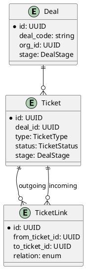
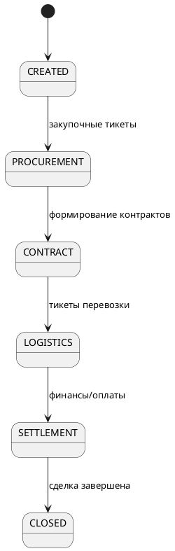

Отлично 🚀
Я подготовлю ТЗ в формате **Confluence-документа**, где всё будет структурировано: разделы, списки, диаграммы (ERD и стадии сделки).

---

# 📑 Confluence-документ: Техническое задание

## Система управления жизненным циклом сделки и платежей GrainChain Spends

---

## 1. Цель проекта

Создать систему, которая охватывает весь **жизненный цикл сделки** (от закупки до расчётов и платежей), с гибким разграничением прав доступа для внутренних и внешних пользователей.

---

## 2. Основные бизнес-процессы

### 2.1 Закупка

* Создаются тикеты закупа.
* Несколько тикетов закупа трансформируются в контракт.
* Закрытые тикеты сохраняют связь (историю номеров).

### 2.2 Контракты

* Формируются тикеты контрактов на основе закупочных тикетов.
* Контракты могут быть внутренними и внешними.

### 2.3 Логистика

* Тикеты для транспортировки: вагоны, поезда, корабли.
* Связаны с контрактами.

### 2.4 Финансовые расчёты и платежи

* Тикеты заявок на оплату.
* Оплаты увязываются с логистикой и контрактами.

### 2.5 Сделка

* Все тикеты связываются в единый тикет сделки.
* Каждая стадия сделки соответствует движению зерна.

---

## 3. Требования к системе авторизации

Авторизация должна учитывать **3 уровня разграничения**:

1. **Функциональный уровень**

   * Какие действия выполняет пользователь.
   * Базовый набор функций задаётся должностью.
   * Дополнительно можно включать/отключать функции.

2. **Организационный уровень**

   * Какие данные пользователь может видеть (своя компания, группа, все).

3. **Уровень стадий сделки**

   * Какие стадии сделки доступны.
   * Примеры:

     * Внешний трейдер — до стадии комплектации.
     * Внутренний трейдер — все стадии.
     * Финансист — только расчёты/платежи.

---

## 4. Пользовательские сценарии

* **Внешний трейдер**: видит только свои сделки, доступ ограничен стадией комплектации.
* **Внутренний трейдер**: видит все стадии сделки, отвечает за сделку целиком.
* **Финансист**: видит только платежные заявки и счета.
* **Логист**: видит только тикеты логистики (вагоны, корабли).

---

## 5. Функциональные требования

1. Управление тикетами (создание, трансформация, закрытие, связи).
2. Управление сделками (агрегация тикетов в общий тикет сделки).
3. Авторизация (функции, организации, стадии).
4. Интерфейс «табло» с фильтрами по организации/стадии/функции.

---

## 6. Нефункциональные требования

* Backend — FastAPI с перспективой микросервисов.
* Масштабируемость для внешних пользователей.
* Безопасность: гибкая настройка прав.
* Трассируемость: история и связи всех тикетов.

---

## 7. Минимальный MVP

1. Сущности: Сделка, Тикет, Пользователь, Организация, Роль/Функции.
2. API для создания тикетов и связей.
3. Авторизация по 3 уровням.
4. Интерфейс табло с фильтрацией доступных сделок.

---

## 8. Диаграммы

### 8.1 ERD (Сделки и тикеты)

### 8.2 State-машина сделки

---

📌 В Confluence документе это можно оформить как страницы:

* **Overview** (Цели + Бизнес-процессы)
* **Authorization Model** (3 уровня доступа)
* **Use Cases** (сценарии пользователей)
* **Functional Requirements**
* **ERD + Workflow Diagrams**

---

Хочешь, я сгенерирую это сразу в **Confluence wiki-разметке** (синтаксис `{panel}`, `{code}`, `{toc}` и т. д.), чтобы можно было вставить напрямую в Confluence?
