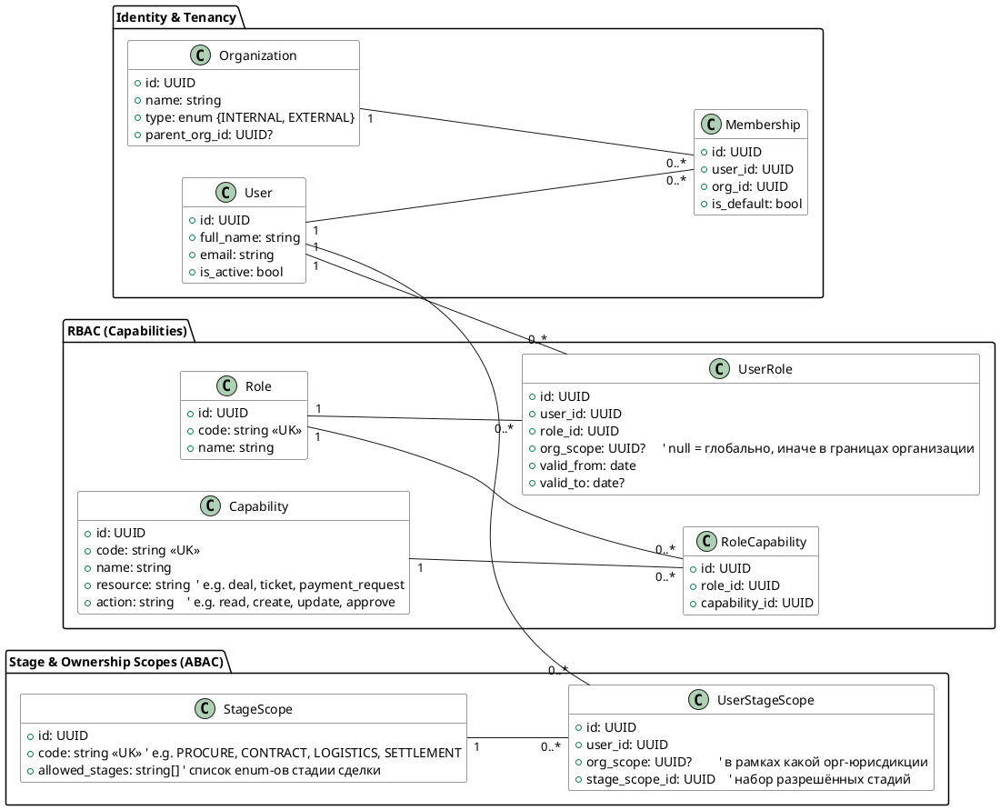
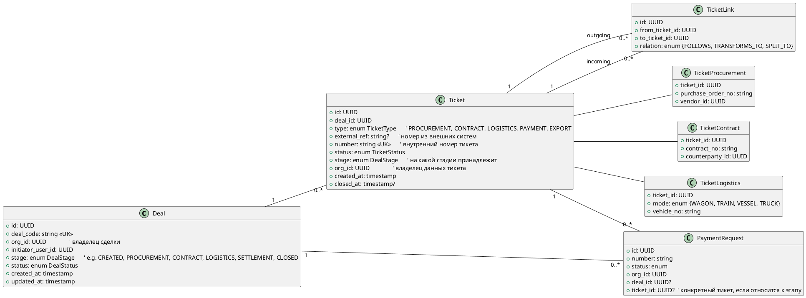
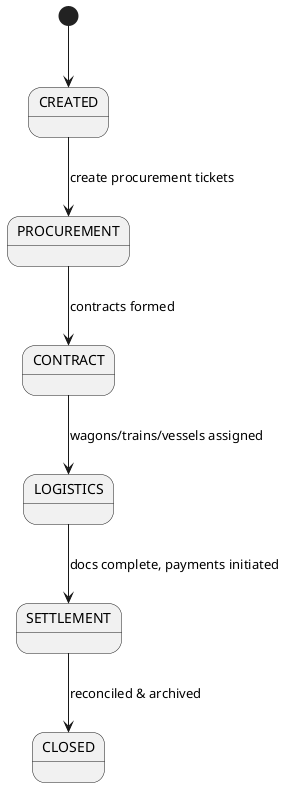

Принял расшифровку. Ниже — целостная архитектура под твои требования: «функции → компании → стадии сделки», плюс модель тикетов по всему жизненному циклу (закуп → контракт → логистика → … → платежи). Дал схемы (PlantUML) и практические шаги для FastAPI/микросервисов.

# 0) Что хочет заказчик (из аудио, кратко)

* Не только «Платежи», а единый **жизненный цикл сделки** из множества **тикетов**:
  закупочные тикеты → контракты → логистика (вагоны/поезда/корабли) → финальный тикет сделки.
* Видимость/права:

  1. **Функции** (что пользователь может делать).
  2. **Компании/владение** (какие данные видит).
  3. **Стадии сделки** (на каких этапах видит/может действовать).
* Внешние пользователи (внешние трейдеры) видят только «свои» сделки/этапы.

---

# 1) Модель доступа: RBAC + ABAC (3 измерения)

База — **RBAC** (роли/функции), сверху — **ABAC**-контекст (organization\_id, deal\_stage, ownership).

## 1.1 Сущности авторизации (ER)



**Итог**: у пользователя есть (а) роли → функции/действия, (б) привязка к организациям (свои/группа/все), (в) набор **разрешённых стадий** сделки для чтения/действий.

---

# 2) Модель сделки и тикетов

Единый **Deal** агрегирует «дочерние» тикеты: закуп, контракты, логистика (вагоны/поезда/корабли), платежи. Тикеты трансформируются (закрываются/«убиваются») с сохранением traceability.

## 2.1 ER ядра сделки/тикетов



## 2.2 State-машина сделки (PlantUML State)



---

# 3) Политики доступа (Policy Engine)

## 3.1 Модель проверки (subject, action, resource, context)

* **Subject**: user\_id, его роли (capabilities), membership, stage scopes.
* **Action**: read | create | update | approve | distribute | close … (capability.action).
* **Resource**: `deal`, `ticket`, `payment_request` …
* **Context**:

  * `org_id` ресурса,
  * `deal_stage` ресурса,
  * `ownership` (инициатор/исполнитель/контрагент),
  * флаги «внешний пользователь» и т. п.

### Правило (псевдокод)

```
allow(user, action, resource, context) =
  hasCapability(user, resource, action)
  AND isOrgAllowed(user, context.org_id)
  AND isStageAllowed(user, context.deal_stage)
  AND isOwnershipAllowed(user, context.ownership)
```

## 3.2 Как хранить ограничения

* **RBAC:** таблицы Role / Capability / RoleCapability / UserRole.
* **Org-scope:** `UserRole.org_scope` и/или `Membership` (по умолчанию — организация пользователя, расширяем на группу/все).
* **Stage-scope:** отдельные пресеты `StageScope` (набор стадий) + `UserStageScope` на пользователя/организацию.

Пример пресетов:

* `Only_Procurement` → {CREATED, PROCUREMENT}
* `Trader_Internal` → {CREATED, PROCUREMENT, CONTRACT, LOGISTICS}
* `Trader_External` → {CREATED, PROCUREMENT, CONTRACT} (без сеттлмента)
* `Finance` → {SETTLEMENT}

---

# 4) FastAPI — реализация без боли

## 4.1 Каркас Policy Enforcer

```python
# app/auth/policy.py
from typing import Set
from pydantic import BaseModel

class CapabilityKey(BaseModel):
    resource: str   # "deal" | "ticket" | "payment_request"
    action: str     # "read" | "create" | "update" | "approve" | ...

class AuthContext(BaseModel):
    user_id: str
    org_id: str | None
    deal_stage: str | None
    ownership: str | None   # "initiator" | "participant" | "external" | ...

class UserGrants(BaseModel):
    capabilities: Set[str]  # {"deal:read", "ticket:create", ...}
    org_whitelist: Set[str] # org_id набор (или спец значение "ALL")
    stage_whitelist: Set[str]  # DealStage codes

def has_capability(grants: UserGrants, cap: CapabilityKey) -> bool:
    return f"{cap.resource}:{cap.action}" in grants.capabilities

def is_org_allowed(grants: UserGrants, org_id: str | None) -> bool:
    if org_id is None:
        return True
    return "ALL" in grants.org_whitelist or org_id in grants.org_whitelist

def is_stage_allowed(grants: UserGrants, stage: str | None) -> bool:
    if stage is None:
        return True
    return stage in grants.stage_whitelist

def is_ownership_allowed(ctx: AuthContext) -> bool:
    # при необходимости: тонкие правила для external/internal
    return True

def allow(grants: UserGrants, cap: CapabilityKey, ctx: AuthContext) -> bool:
    return (
        has_capability(grants, cap) and
        is_org_allowed(grants, ctx.org_id) and
        is_stage_allowed(grants, ctx.deal_stage) and
        is_ownership_allowed(ctx)
    )
```

## 4.2 FastAPI dependency + guard

```python
# app/auth/deps.py
from fastapi import Depends, HTTPException, status
from .policy import UserGrants, CapabilityKey, AuthContext, allow

async def get_user_grants(user_id: str) -> UserGrants:
    # собрать из БД: роли -> capabilities; membership -> org_whitelist; stage_scope -> stage_whitelist
    ...

def require(capability: CapabilityKey):
    async def _inner(user=Depends(current_user),
                     grants: UserGrants = Depends(get_user_grants),
                     ctx: AuthContext = Depends(get_auth_context)):
        if not allow(grants, capability, ctx):
            raise HTTPException(status_code=status.HTTP_403_FORBIDDEN)
        return True
    return _inner
```

Пример использования в роутере:

```python
@router.get("/deals/{deal_id}", dependencies=[Depends(require(CapabilityKey(resource="deal", action="read")))])
async def get_deal(deal_id: UUID): ...
```

## 4.3 Контекст ресурса

* Извлекаем `org_id`, `deal_stage` по `deal_id`/`ticket_id` до хэндлера (dependency `get_auth_context`).
* Для списков — фильтруем по `org_whitelist` и `stage_whitelist` SQL-where’ом (не только на уровне кода).

---

# 5) Как связать «убитые» и «новые» тикеты

* Таблица `ticket_link(relation=TRANSFORMS_TO)` хранит lineage.
* При «превращении» закупочных тикетов в контракт:

  1. закрыть исходные,
  2. создать контракт-тикеты,
  3. записать связи,
  4. перенести «контекстные» ссылки (e.g. на заявки оплаты) по правилам.

---

# 6) Типичные проблемы и как их обойти (в контексте будущего роста)

1. **Сложные join’ы при выборках списков**
   → Всегда фильтруй на уровне SQL по `org_id` и `deal_stage`. Вынеси «легковесные» read-модели (CQRS), создай материализованные вьюхи под дашборды.

2. **Дубли и гонки при создании тикетов/заявок**
   → `Idempotency-Key` + уникальные индексы + транзакции. Версионирование строк (`row_version`) для PATCH.

3. **Внешние пользователи**
   → Разделяй `Organization.type` (INTERNAL/EXTERNAL); по умолчанию `org_whitelist={own_org}` и урезанный `stage_whitelist`. Для межкомпаний — выдавай доп-мембершипы на «группу».

4. **Переезд на микросервисы**

   * Сейчас: единая БД, строгие FK.
   * Потом: разнос контекстов (identity, directory, deals/tickets, payments, logistics) — **без кросс-FK**, обмен через событийную шину + локальные read-модели.

5. **Аудит и воспроизводимость**
   → `request_events`/`ticket_events` как `JSONB` + GIN индексы; снимки (snapshots) в отдельной таблице; сводные timeline-ленты на UI.

---

# 7) Минимальные DDL-расширения (фрагменты)

```sql
-- Organizations & membership
create table organizations(
  id uuid primary key default gen_random_uuid(),
  name varchar(255) not null,
  type varchar(16) not null check (type in ('INTERNAL','EXTERNAL')),
  parent_org_id uuid references organizations(id)
);

create table memberships(
  id uuid primary key default gen_random_uuid(),
  user_id uuid not null references users(id),
  org_id uuid not null references organizations(id),
  is_default boolean default false
);

-- Capabilities
create table capabilities(
  id uuid primary key default gen_random_uuid(),
  code varchar(64) unique not null,
  name varchar(128) not null,
  resource varchar(64) not null,
  action varchar(32) not null
);
create table role_capabilities(
  id uuid primary key default gen_random_uuid(),
  role_id uuid not null references roles(id),
  capability_id uuid not null references capabilities(id),
  unique(role_id, capability_id)
);

-- Stage scopes
create table stage_scopes(
  id uuid primary key default gen_random_uuid(),
  code varchar(64) unique not null,
  allowed_stages text not null -- JSON array of DealStage
);
create table user_stage_scopes(
  id uuid primary key default gen_random_uuid(),
  user_id uuid not null references users(id),
  org_scope uuid references organizations(id),
  stage_scope_id uuid not null references stage_scopes(id)
);

-- Deals & tickets
create type deal_stage as enum ('CREATED','PROCUREMENT','CONTRACT','LOGISTICS','SETTLEMENT','CLOSED');

create table deals(
  id uuid primary key default gen_random_uuid(),
  deal_code varchar(64) unique not null,
  org_id uuid not null references organizations(id),
  initiator_user_id uuid not null references users(id),
  stage deal_stage not null default 'CREATED',
  status varchar(32) not null default 'ACTIVE',
  created_at timestamp default now(),
  updated_at timestamp default now()
);

create type ticket_type as enum ('PROCUREMENT','CONTRACT','LOGISTICS','PAYMENT','EXPORT');

create table tickets(
  id uuid primary key default gen_random_uuid(),
  deal_id uuid not null references deals(id),
  type ticket_type not null,
  external_ref varchar(128),
  number varchar(64) unique not null,
  status varchar(32) not null default 'OPEN',
  stage deal_stage not null,
  org_id uuid not null references organizations(id),
  created_at timestamp default now(),
  closed_at timestamp
);

create table ticket_links(
  id uuid primary key default gen_random_uuid(),
  from_ticket_id uuid not null references tickets(id),
  to_ticket_id uuid not null references tickets(id),
  relation varchar(32) not null check (relation in ('FOLLOWS','TRANSFORMS_TO','SPLIT_TO'))
);
create index idx_ticket_links_from on ticket_links(from_ticket_id);
create index idx_ticket_links_to on ticket_links(to_ticket_id);
```

---

# 8) Как это «садится» на текущий модуль «Платежи»

* В `payment_requests` добавь `deal_id` и, при необходимости, `ticket_id`.
* При создании платежа из логистического этапа — указываем `ticket_id` (stage=LOGISTICS).
* Политики:

  * **Finance** видит `SETTLEMENT`,
  * **Internal trader** видит до `LOGISTICS`,
  * **External trader** — до `CONTRACT` (пример).
* Фильтрация списков: `WHERE pr.org_id IN (:org_whitelist) AND deal.stage IN (:stage_whitelist)`.

---

# 9) Переход к микросервисам — порядок

1. **Identity & Tenancy** отделить первым (OIDC/JWT + grants API).
2. **Deals & Tickets** как централизованный домен.
3. **Payments** как отдельный сервис, подписчик событий из Deals/Tickets.
4. **Logistics** отдельным доменом; интеграции с внешними системами.
5. **Contracts** отдельно, эвенты «ContractCreated/Updated».

---

# 10) Что сделать прямо сейчас (следующие 7 задач)

1. Ввести таблицы `organizations`, `memberships`, `capabilities`, `role_capabilities`.
2. Добавить `stage_scopes` и `user_stage_scopes`; зашить первые пресеты.
3. Создать таблицы `deals`, `tickets`, `ticket_links`; привязать `payment_requests` к `deal_id`/`ticket_id`.
4. Реализовать **Policy Enforcer** и dependency-guard для FastAPI.
5. Переделать списки/детали `GET /payment-requests` с фильтрацией по org/stage.
6. В seed-данных настроить типичных пользователей: internal trader, external trader, finance, registrar.
7. Добавить тесты (unit политики + e2e выборки с фильтрами).

---

Если хочешь, сгенерирую **PDF-док** с этими диаграммами/DDL/псевдокодом и отдам файл — скажи, и сделаю сразу.
